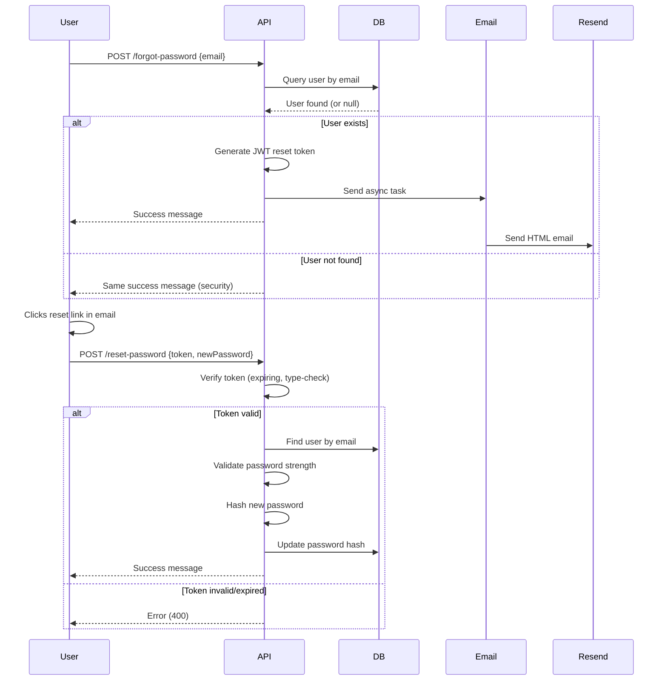

# Password Reset Flow Documentation

## Overview

This document describes the "Forgot Password" and "Reset Password" flow implemented in your FastAPI authentication system.

---

## Endpoints

### 1. Request Password Reset (POST `/forgot-password`)

**Purpose:** Initiates the password reset process by sending a reset link to the user's email.

**Request:**
```json
{
  "email": "user@example.com"
}
```

**Response (Success):**
```json
{
  "message": "If an account with that email address exists, a password reset link has been sent."
}
```

**Behavior:**
- Looks up the user by email in the database
- If found: generates a JWT token and sends an HTML email with reset link
- **Security:** Returns the same response whether or not the email exists (prevents email enumeration attacks)
- Uses `BackgroundTasks` to send the email asynchronously (doesn't block the response)

**Example cURL:**
```bash
curl -X POST http://localhost:8000/api/v1/auth/forgot-password \
  -H "Content-Type: application/json" \
  -d '{"email":"user@example.com"}'
```

---

### 2. Reset Password (POST `/reset-password`)

**Purpose:** Allows users to set a new password using their reset token.

**Request:**
```json
{
  "token": "eyJhbGciOiJIUzI1NiIsInR5cCI6IkpXVCJ9...",
  "new_password": "YourNewSecurePass123!"
}
```

**Response (Success):**
```json
{
  "message": "Your password has been successfully reset. You can now log in with your new password."
}
```

**Validation:**
- Validates the reset token (checks expiration and signature)
- Ensures token is type-scoped for resets only (cannot be reused as access token)
- Verifies the new password meets strength requirements (minimum 8 characters + other rules from `require_strong_password`)
- Hashes and updates the password in the database

**Error Responses:**

400 Bad Request - Invalid/Expired Token:
```json
{
  "detail": "Invalid or expired reset token"
}
```

404 Not Found - User Missing:
```json
{
  "detail": "User not found"
}
```

400 Bad Request - Weak Password:
```json
{
  "detail": {
    "password_validation_errors": ["Password must contain at least one uppercase letter", ...]
  }
}
```

**Example cURL:**
```bash
curl -X POST http://localhost:8000/api/v1/auth/reset-password \
  -H "Content-Type: application/json" \
  -d '{
    "token": "eyJhbGciOiJIUzI1NiIsInR5cCI6IkpXVCJ9...",
    "new_password": "SecurePass123!"
  }'
```

---

## Security Features

### Token Security
- **Type Scoping:** Reset tokens have `"type": "reset"` claim, preventing reuse as access tokens
- **Short Expiry:** Tokens expire after 30 minutes (configurable via `RESET_TOKEN_EXPIRE_MINUTES`)
- **Unique Generation:** Each token uses JWT with cryptographic signing
- **No Email Enumeration:** Generic success messages prevent attackers from discovering valid emails

### Email Security
- **Asynchronous Sending:** Uses FastAPI `BackgroundTasks` to avoid blocking
- **Graceful Fallback:** If email service fails, the API still returns success (doesn't crash)
- **HTML Template:** Professional email with clear instructions and security warnings

### Password Validation
- Reuses existing `require_strong_password()` function from your codebase
- Minimum 8 characters enforced in schema validator
- Additional complexity rules defined in `security_middleware.py`

---

## Configuration

### Environment Variables Required

Add these to your `.env` file:

```bash
# Get from https://resend.com/api-keys
RESEND_API_KEY=re_your_actual_api_key_here

# Your app's base URL (where reset link will redirect)
APP_URL=http://localhost:8000
```

### Resend Setup

1. Sign up at [https://resend.com](https://resend.com)
2. Get your API key from the dashboard
3. Note: Free tier allows 3,000 emails/month and 100 unique recipients

### Testing Without Resend

The code gracefully handles missing `RESEND_API_KEY`:
- Logs a warning instead of crashing
- Still generates and returns tokens (for testing purposes)
- In production, always set `RESEND_API_KEY`

---

## Implementation Details

### File Structure

| File | Purpose |
|------|---------|
| `app/services/email.py` | Email service with Resend integration |
| `app/core/security.py` | Token creation and verification functions |
| `app/schemas/user_schema.py` | Pydantic models for requests/responses |
| `app/api/v1/auth.py` | Endpoint implementations |

### Token Payload Structure

```python
{
    "sub": "user@example.com",      # User's email
    "type": "reset",                # Token scope identifier
    "iat": 1718712000,              # Issued at timestamp
    "exp": 1718713800               # Expiration (30 min later)
}
```

### How It Works



---

## Frontend Integration Example

### React Component Snippet

```jsx
import { useState } from 'react';

function ForgotPassword() {
  const [email, setEmail] = useState('');
  const [message, setMessage] = useState('');
  const [error, setError] = useState('');

  const handleSubmit = async (e) => {
    e.preventDefault();
    
    try {
      const res = await fetch('/api/v1/auth/forgot-password', {
        method: 'POST',
        headers: { 'Content-Type': 'application/json' },
        body: JSON.stringify({ email })
      });
      
      const data = await res.json();
      setMessage(data.message);
    } catch (err) {
      setError('Failed to send reset email');
    }
  };

  return (
    <form onSubmit={handleSubmit}>
      <input 
        type="email" 
        value={email} 
        onChange={(e) => setEmail(e.target.value)} 
        placeholder="Enter your email"
        required
      />
      <button type="submit">Send Reset Link</button>
      {message && <p>{message}</p>}
      {error && <p style={{color: 'red'}}>{error}</p>}
    </form>
  );
}
```

### Reset Password Page

The reset link from the email should point to:
```
http://localhost:8000/reset-password?token=<JWT_TOKEN>
```

Frontend should extract the token from the query params and present a form to enter the new password.

---

## Testing Checklist

- [ ] Install Resend SDK: `pip install resend`
- [ ] Add `RESEND_API_KEY` to `.env` file
- [ ] Test `/forgot-password` with valid email → check inbox for reset link
- [ ] Test `/forgot-password` with invalid email → verify no info disclosed
- [ ] Copy token from email URL and test `/reset-password` endpoint
- [ ] Verify old password no longer works after reset
- [ ] Test token expiration (wait 30+ minutes, then try reset)
- [ ] Test weak password rejection on `/reset-password`

---

## Troubleshooting

### Email not arriving
- Check spam/junk folder
- Verify `RESEND_API_KEY` is correctly set in `.env`
- Review server logs for `[Email Service]` error messages
- Confirm sender domain is verified in Resend dashboard

### Token validation fails
- Ensure the full token string is passed (no truncation)
- Check if token was extracted from URL query parameter correctly
- Verify `SECRET_KEY` hasn't changed between token generation and verification

### Background task doesn't execute
- Ensure you're running with Uvicorn (background tasks require async server)
- Check for exceptions during startup
- Verify dependency injection is working (`get_db` is properly configured)

---

## Future Enhancements

Consider adding:
- Rate limiting on both endpoints (prevent abuse)
- Email rate limiting (max 1 request per minute per IP)
- Audit logging (track when reset requests are made)
- IP address tracking in token payload
- Option to cancel pending reset tokens
- Multi-factor authentication recovery

---

## References

- [FastAPI Background Tasks](https://fastapi.tiangolo.com/advanced/background-tasks/)
- [PyJWT Documentation](https://pyjwt.readthedocs.io/)
- [Resend Python SDK](https://resend.com/docs/mail/send-email)
- [OWASP Password Storage Cheat Sheet](https://cheatsheetseries.owasp.org/cheatsheets/Password_Storage_Cheat_Sheet.html)
